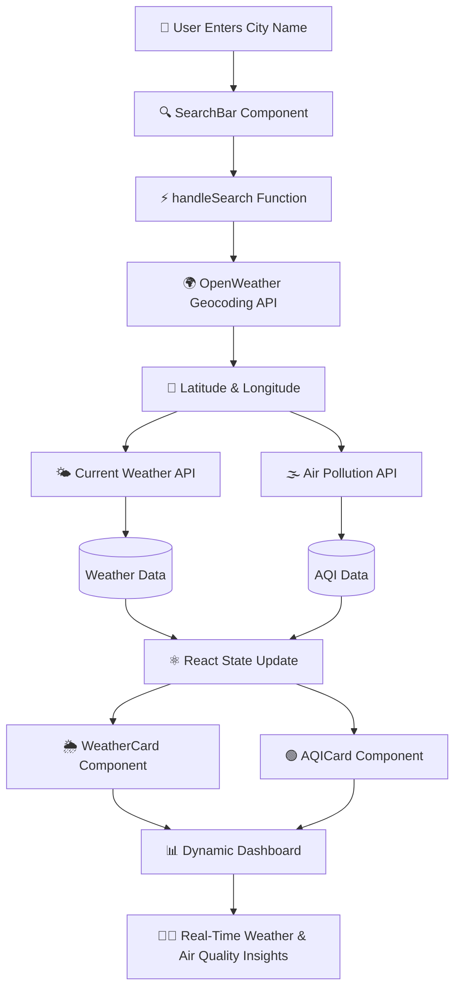

# 🌤️ WAirBoard - Weather & Air Quality Dashboard

WAirBoard is a responsive Weather & Air Quality Dashboard built using **React.js** and **Vite** that provides real-time weather information and air quality insights for cities across the globe. The application integrates multiple OpenWeather APIs to fetch and display live environmental data in a modern, user-friendly dashboard.
---

# 📌 Features

## 🌍 City-Based Search
* Search for any city worldwide.
* Converts city names into geographical coordinates using the OpenWeather Geocoding API.

## 🌤️ Real-Time Weather Information
Displays live weather metrics including:
* Temperature & Humidity
* Wind Speed & Weather Condition
* Atmospheric Pressure & Visibility
* Sunrise Time & Sunset Time

## 🎨 Dynamic Weather Icons
* Automatically displays weather-specific icons.
* Icons update dynamically based on current weather conditions.

## 🌫️ Air Quality Monitoring
Displays real-time pollution metrics including:
* Air Quality Index (AQI)
* PM2.5
* PM10
* Carbon Monoxide (CO)
* Nitrogen Dioxide (NO₂)
* Ozone (O₃)

## 🟢 Dynamic AQI Status Badges

| AQI Value | Status | Badge Color | Air Quality Level |
|-----------|---------|-------------|-------------------|
| 1 | Good | 🟢 Green | Excellent |
| 2 | Fair | 🟩 Light Green | Acceptable |
| 3 | Moderate | 🟡 Yellow | Moderate Pollution |
| 4 | Poor | 🟠 Orange | Unhealthy |
| 5 | Very Poor | 🔴 Red | Highly Unhealthy |

The AQI badge updates dynamically based on real-time API data and visually indicates current air quality conditions.

## ⚡ Modern User Interface
* Card-based dashboard layout
* Responsive design
* Hover animations
* Dynamic AQI badges
* Weather-themed background
* Clean and intuitive user experience

## 🔄 API Driven Architecture
* Real-time data retrieval
* Dynamic UI updates
* No hardcoded environmental information

## 🚨 Error Handling
* Invalid city detection
* API request failure handling
* User-friendly error messages

## ⏳ Loading States
* Displays loading indicators while fetching API data.

---

# ⚙️ Workflow



## 🏗️ Detailed Workflow

* **Step 1** -> The user enters a city name into the SearchBar component.
* **Step 2** -> The city name is converted into geographical coordinates (latitude and longitude).
* **Step 3** -> Using the coordinates, the OpenWeather Weather API fetches: Temperature, Humidity, Wind Speed, Pressure, Visibility, Sunrise Time, Sunset Time, Weather Condition
* **Step 4** -> Using the same coordinates, the Air Pollution API fetches:
   * AQI & PM2.5
   * PM10 & CO
   * NO₂ & O₃
* **Step 5** -> Fetched API data is stored in React state variables.
* **Step 6** -> WeatherCard and AQICard components are rendered only when valid data is available.
* **Step 7** -> React automatically updates the user interface with the latest weather and air quality information.
---

## 🛠️ Tech Stack

* **Frontend** -> React.js, Vite, JavaScript (ES6+), HTML5, CSS3
* **APIs** -> OpenWeather Geocoding API, OpenWeather Current Weather API, OpenWeather Air Pollution API
* **Development Tools** -> Visual Studio Code, Git, GitHub, npm
---

# 📂 Folder Structure

```text
src/
│
├── components/
│   │
│   ├── SearchBar/
│   │   ├── SearchBar.jsx
│   │   └── SearchBar.css
│   │
│   ├── WeatherCard/
│   │   ├── WeatherCard.jsx
│   │   └── WeatherCard.css
│   │
│   ├── AQICard/
│   │   ├── AQICard.jsx
│   │   └── AQICard.css
│
├── services/
│   └── WeatherAPI.js
│
├── App.jsx
├── App.css
├── main.jsx
│
└── .env
```

---

# 🚀 Getting Started

## 1. Clone the Repository

```bash
git clone https://github.com/Srijit27/WAirBoard.git
```

## 2. Navigate to the Project Directory

```bash
cd weather-aqi-dashboard
```

## 3. Install Dependencies

```bash
npm install
```

## 4. Create Environment Variables

Create a `.env` file:

```env
VITE_WEATHER_API_KEY=your_api_key_here
```

## 5. Obtain an OpenWeather API Key

1. Create an account on OpenWeather.
2. Generate a new API key.
3. Add the key to the `.env` file.

## 6. Start the Development Server

```bash
npm run dev
```

## 7. Open the Application

http://localhost:5173

---

# 🎯 Learning Outcomes

- React Component Architecture
- Props and State Management
- API Integration
- Asynchronous JavaScript
- Environment Variables
- Conditional Rendering
- Dynamic UI Updates
- Responsive Design
- CSS Grid and Flexbox
- Error Handling
- Modular Project Structure

---

# 🔮 Future Enhancements

* 🌦️ 5-Day Weather Forecast
* 🌙 Dark Mode Support
* 📍 Geolocation-Based Weather Detection
* ⭐ Favorite Cities
* 📈 Weather Analytics Charts
* 🕒 Hourly Forecast
* 🚨 Weather Alerts
* 📱 Progressive Web App (PWA) Support
* 🔍 Search History
* 🌎 Multi-Language Support

---

# 💙 Thank You

Thank you for visiting the WAirBoard project repository.

If you found this project helpful or interesting, consider giving it a ⭐ on GitHub. Your support and feedback are greatly appreciated and help motivate future improvements.

Happy Coding! 🚀
